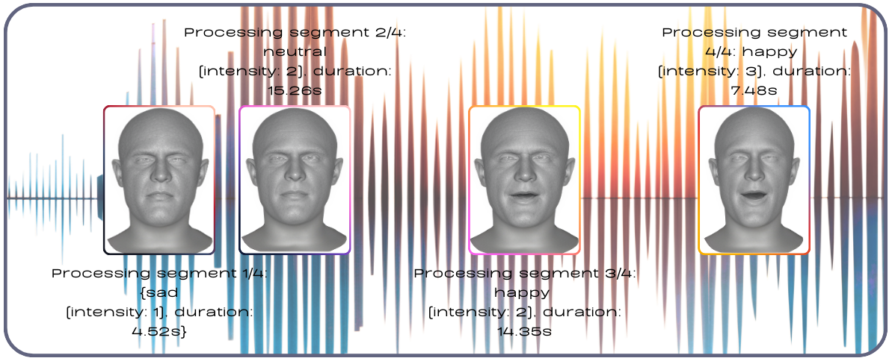

# SEDTalker: Speech-Driven 3D Facial Animation with Emotion Conditioning
### International Conference on Pattern Recognition (ICPR 2026)

Farzaneh Jafari, Stefano Berretti, Anup Basu

[[Paper]]()|[[Project Page]](https://farzanehjafari1987.github.io/SEDTalker.github.io/)|[[License]](https://github.com/FarzanehJafari1987/SEDTalker/blob/main/LICENSE)

<p align="center">
  
</p>

## Key Features

### 1. Emotion-Conditioned Animation
- **6 Emotions**: Happy 😊, Sad 😢, Angry 😠, Disgust 🤢, Fear 😨, Upset 😔 + Neutral 😐
- **3 Intensity Levels**: Low (⚪), Medium (🔵), High (🔴)
- **18 Unique Combinations**: Each emotion × intensity pair creates distinct expressions

### 2. Speech Emotion Diarization
- Automatic emotion detection from audio
- Temporal segmentation with configurable chunk sizes
- Intensity estimation (low/medium/high)
- Chunk reduction for smoother, longer segments

### 3. Advanced Smoothing
- Vertex-level temporal smoothing (not emotion blending!)
- Preserves pure emotions while creating smooth motion
- Gaussian or Savitzky-Golay filtering
- Configurable smoothing strength

---

## Quick Start

### Prerequisites

- Python 3.8+
- CUDA-capable GPU (recommended)
- FFmpeg (for video rendering with audio)
- Download [JambaTalk](https://github.com/FarzanehJafari1987/JambaTalk) model

### Environment Setup

1. **Set up the JambaTalk environment:**

   Follow the installation instructions from the official JambaTalk repository: **[JambaTalk GitHub](https://github.com/FarzanehJafari1987/JambaTalk)**

2. **Clone this repository:**

   ```bash
   git clone https://github.com/your-repo/SEDTalker.git
   cd SEDTalker
   ```

3. **Install additional dependencies:**

   ```bash
   pip install scipy pyrender opencv-python
   ```

### Download Pre-trained Models

Download the pre-trained JambaTalk and SED models:

**[Download Models from Google Drive](https://drive.google.com/file/d/1tj3CLril0hZy9R_KQPV68NnuIGHo-EF9/view?usp=drive_link)**

**Extract and organize:**

```bash
# Extract the downloaded models,
unzip models.zip

# Expected structure:
# SEDTalker/
# ├── EmoVOCA/
# │   ├── save/
# │   │   └── 50_model.pth          # JambaTalk model trained on EmoVOCA
# │   ├── templates.pkl
# │   └── FLAME_sample.ply
# └── SED/
#     └── results/
#         └── emotion_diarization_7class/
#             └── save/CKPT+epoch_50/
#                 └── model.ckpt    # SED model
```

**Verify installation:**

```bash
# Quick test with demo audio
python demo.py --wav_path SED/wav/mixed_test.wav

# Should see:
# Audio: SED/wav/mixed_test.wav
# FLAME: EmoVOCA/FLAME_sample.ply
# Model: EmoVOCA/save/50_model.pth
```

### Basic Usage

```bash
# Run with default settings
python demo.py --wav_path your_audio.wav

# With chunk reduction (recommended)
python demo.py \
  --wav_path your_audio.wav \
  --chunk_duration 4.0 \
  --min_segment_duration 2.0

# Adjust smoothing
python demo.py \
  --wav_path your_audio.wav \
  --smooth_sigma 1.5
```

### Expected Output

```

EMOTION-CONDITIONED 3D ANIMATION (IMPROVED SMOOTHING)
----------------------------------------------------------------------
Validating inputs...
Audio: your_audio.wav
FLAME: EmoVOCA/FLAME_sample.ply
Model: EmoVOCA/save/50_model.pth


STEP 1: EMOTION DIARIZATION
======================================================================
Running emotion diarization...
Generated: demo/output/your_audio_emotions.json

Loaded 15 emotion segments

Emotion distribution:
  😊 happy   :   3 segments
  😢 sad     :   2 segments
  😠 angry   :   4 segments


EMOTION-INTENSITY TIMELINE
----------------------------------------------------------------------
   1.   0.000s -   4.520s ( 4.520s)  😢 s         ▁▁▁▁ low     
   2.   4.520s -  19.780s (15.260s)  😐 n         ▄▄▄▄ medium  
   3.  19.780s -  34.130s (14.350s)  😊 h         ▄▄▄▄ medium  
   4.  34.130s -  41.610s ( 7.480s)  😊 h         ████ high    

EMOTION DISTRIBUTION:
----------------------------------------------------------------------
  😐 n       :  15.26s ( 37.1%)  ██████████████████
  😊 h       :  21.83s ( 53.1%)  ██████████████████████████
  😢 s       :   4.52s ( 11.0%)  █████

INTENSITY DISTRIBUTION:
----------------------------------------------------------------------
  high  :   7.48s ( 18.2%)  █████████
  medium:  29.61s ( 72.0%)  ████████████████████████████████████
  low   :   4.52s ( 11.0%)  █████

APPLYING TEMPORAL VERTEX SMOOTHING
======================================================================
  Method: Gaussian filter
  Sigma: 1.0
  Window: 5 frames
  Smoothing 5023 vertices across 1230 frames...
Temporal smoothing applied

STEP 7: RENDER VIDEO
======================================================================
Video saved: demo/output/your_audio_video.mp4

COMPLETED!
```

---
## 📖 Detailed Usage

### Chunk Reduction

Reduce the number of emotion segments for smoother, more stable animations:

```bash
# Moderate reduction (recommended)
python demo.py \
  --wav_path audio.wav \
  --chunk_duration 4.0 \
  --min_segment_duration 2.0

# Aggressive reduction
python demo.py \
  --wav_path audio.wav \
  --chunk_duration 6.0 \
  --min_segment_duration 3.0 \
  --merge_same_emotions \
  --merge_gap_threshold 1.0
```

**Parameters:**
- `--chunk_duration`: SED analysis window (2.0-8.0s)
  - `2.0` = Default, many segments
  - `4.0` = Recommended, balanced
  - `6.0+` = Fewer, longer segments
  
- `--min_segment_duration`: Minimum segment length (seconds)
  - `0.0` = Keep all segments
  - `2.0` = Recommended, removes brief flickers
  - `3.0+` = Aggressive filtering

- `--merge_same_emotions`: Merge consecutive same emotions
- `--merge_gap_threshold`: Max gap for merging (0.5-2.0s)

### Smoothing Options

```bash
# Light smoothing (subtle)
python demo.py --wav_path audio.wav --smooth_sigma 0.5

# Medium smoothing (default, recommended)
python demo.py --wav_path audio.wav --smooth_sigma 1.0

# Heavy smoothing (very smooth)
python demo.py --wav_path audio.wav --smooth_sigma 2.0

# Savitzky-Golay filter (preserves peaks better)
python demo.py --wav_path audio.wav --smooth_method savgol

# Disable smoothing (compare)
python demo_better_smooth.py --wav_path audio.wav --no_smooth
```

**Smoothing Methods:**
- **Gaussian** (default): Best for general use, natural motion
- **Savitzky-Golay**: Better preserves sharp features, good for dramatic content

**Sigma Values:**
- `0.5` - Light, responsive to quick changes
- `1.0` - Medium, balanced (recommended)
- `1.5` - Moderate, smoother
- `2.0` - Heavy, very fluid motion

---

## Content-Specific Recommendations

### Fast Dialogue/Conversation
```bash
python demo.py \
  --wav_path dialogue.wav \
  --chunk_duration 2.5 \
  --min_segment_duration 1.0 \
  --smooth_sigma 0.8
```

### Normal Speech/Presentation (Recommended)
```bash
python demo.py \
  --wav_path presentation.wav \
  --chunk_duration 4.0 \
  --min_segment_duration 2.0 \
  --smooth_sigma 1.0
```

### Narration/Audiobook
```bash
python demo.py \
  --wav_path audiobook.wav \
  --chunk_duration 6.0 \
  --min_segment_duration 3.0 \
  --smooth_sigma 1.2
```

### Dramatic/Theatrical
```bash
python demo.py \
  --wav_path drama.wav \
  --chunk_duration 3.0 \
  --min_segment_duration 1.5 \
  --smooth_sigma 0.5 \
  --smooth_method savgol
```

---

## Training Your Own Model

### Training

```bash
python train.py \
  --dataset EmoVOCA \
  --lr 0.0001 \
  --max_epoch 100 \
  --feature_dim 512 \
  --device cuda
```

**Training Features:**
- Emotion-conditioned generation
- 3 intensity levels per emotion
- MSE loss with velocity regularization
- Lip sync loss with CTC
- Gradient accumulation support

### Testing

```bash
python test.py \
  --dataset EmoVOCA \
  --save_path save_512_12_10_22_42 \
  --max_epoch 50 \
  --test_emotion Smile2 \
  --test_intensity 3
```

---

## Output Structure

```
demo/output/
├── your_audio_emotions.json      # Emotion timeline from SED
├── your_audio_video.mp4          # Final animation with audio
└── meshes/                       # If --save_meshes enabled
    ├── 00000.obj
    └── ...
```

### Emotion JSON Format

```json
{
  "audio_file": "your_audio.wav",
  "duration": 41.61,
  "segments": [
    {
      "start": 0.0,
      "end": 4.52,
      "emotion": "s",
      "intensity": "low",
      "confidence": 0.89
    },
    ...
  ]
}
```

---

## Emotion System

### Emotion Mappings

| SED Output | JambaTalk | Emoji | Description |
|------------|-----------|-------|-------------|
| h | happy | 😊 | Joyful, smiling |
| s | sad | 😢 | Sorrowful, downcast |
| a | angry | 😠 | Frustrated, tense |
| d | disgust | 🤢 | Repulsed, negative |
| f | fear | 😨 | Afraid, anxious |
| u | upset | 😔 | Disappointed, troubled |
| n | neutral | 😐 | Baseline, calm |

### Intensity Visualization

- **████** High (3) 🔴 - Maximum expression strength
- **▄▄▄▄** Medium (2) 🔵 - Moderate expression
- **▁▁▁▁** Low (1) ⚪ - Subtle expression

---

## Technical Details

### Architecture

**JambaTalk**: Hybrid Transformer-Mamba model
- **Audio Encoder**: Wav2Vec2 (pre-trained)
- **Feature Dimension**: 512
- **Sequence Backbone**: Mamba layers for temporal modeling
- **Emotion Conditioning**: Learned embeddings (6 emotions × 3 intensities)
- **Output**: 5023 vertices × 3 coordinates (FLAME topology)

### Smoothing: The Right Way

**We do NOT blend emotions** (that creates weird morphed faces!)

**Instead:**
1. Apply emotions **sharply** (pure expressions)
2. Smooth **vertex motion** over time (Gaussian filter)

```
Frame 100: Pure Happy 😊  (vertices at position A)
Frame 101: Pure Happy 😊  (vertices smoothly glide to B)
Frame 102: Pure Sad 😢    (vertices smoothly glide to C)  
Frame 103: Pure Sad 😢    (vertices at position D)
```

**Result**: Clean emotions + smooth motion = natural!

---

## Performance

- **Throughput**: 600-800 FPS (generation)
- **Real-time Factor**: ~20x (on RTX 3090)
- **Memory**: ~4GB GPU (batch size 1)
- **Rendering**: 30 FPS @ 800×800 resolution

---

## Pipeline Overview

```
Input Audio (WAV)
    ↓
[1] Speech Emotion Diarization (SED)
    → Detect emotions & intensity
    → Chunk audio (2-8s segments)
    → Generate emotion timeline
    ↓
[2] Audio Feature Extraction
    → Wav2Vec2 encoder
    → 512-dim features
    ↓
[3] Emotion Conditioning
    → Apply emotion embeddings
    → Per-segment with intensity
    → Sharp transitions (no blending!)
    ↓
[4] JambaTalk Generation
    → Mamba sequence modeling
    → Predict vertex offsets
    → FLAME topology (5023 vertices)
    ↓
[5] Temporal Smoothing
    → Gaussian filter on vertices
    → Smooth motion, pure emotions
    ↓
[6] Video Rendering
    → PyRender (800×800 @ 30fps)
    → FFmpeg audio sync
    ↓
Output: Emotion-conditioned 3D talking head video
```

---

## Citation

If you use SEDTalker in your research, please cite:

```bibtex
@article{sedtalker2025,
  title={SEDTalker: Speech-Driven 3D Facial Animation with Emotion Conditioning},
  author={Farzaneh Jafari, Stefano Berretti, Anup Basu},
  journal={arXiv preprint},
  year={2026}
}

@misc{jambatalk2026jafari,
 title={JambaTalk: Speech-driven 3D Talking Head Generation based on a Hybrid Transformer-Mamba Model},
 author={Farzaneh Jafari, Stefano Berretti, Anup Basu},
 note={Transactions on Multimedia Computing, Communications, and Applications},
 doi={10.1145/3793196},
 year={2026}
}
```

---

## Acknowledgments

- **[JambaTalk](https://github.com/FarzanehJafari1987/JambaTalk)**: Hybrid Transformer-Mamba architecture for facial animation
- **[Pre-trained Models](https://drive.google.com/file/d/1tj3CLril0hZy9R_KQPV68NnuIGHo-EF9/view?usp=drive_link)**: JambaTalk and SED emotion diarization models
- **FLAME**: 3D face model topology
- **EmoVOCA**: Emotional speech dataset
- **Wav2Vec2**: Pre-trained audio encoder from Hugging Face Transformers

---

## 📄 License

This project is licensed under the MIT License - see the [LICENSE](LICENSE) file for details.
